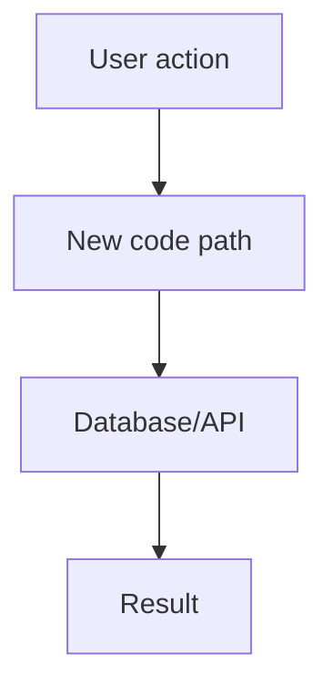

# PR Review

Use this skill for rigorous code review inspired by Nolan Lawson’s “write better code more slowly” approach: AI-generated or human-generated code is only a first draft. The value comes from independent review, synthesis, severity ranking, and validation before fixes happen.

## Core principle

Do not rush to fixes. First understand the scope, gather context, run independent reviews, then synthesize. Avoid letting early findings bias later analysis.

The subagent pass is the heart of this skill. Distinct models catch different classes of issues, and independent agreement is a strong signal. Do not do false-positive research or synthesis until all reviewers have returned.

## Accepted inputs

The user may provide:

- A PR URL
- `owner/repo#number`
- A branch name
- A commit SHA
- File paths
- No explicit scope, in which case infer the best available diff

## Determine scope

Determine review scope in this priority order:

1. Explicit user scope:
   - PR URL
   - `owner/repo#number`
   - branch name
   - commit SHA
   - file paths
2. Current feature branch diff vs main:
   - `git diff main...HEAD`
3. Staged changes:
   - `git diff --staged`
4. Latest commit:
   - `git show --stat --patch HEAD`

For a PR, use `gh` to fetch the PR context when available:

- PR metadata
- changed files
- diff
- base/head branches
- linked issue or PR body if available
- review comments if relevant
- commit list if useful

If `gh` is unavailable or unauthenticated, fall back to git commands and clearly state the limitation.

## Context to collect before review

Collect enough context for reviewers to judge whether the diff is correct, not merely whether it is tidy.

Include:

- The diff or patch
- The changed file list
- PR title/body or linked issue/PRD when available
- Relevant tests
- Nearby code needed to understand the change
- Data model/schema/migrations when relevant
- Package/framework conventions when relevant

Pay special attention to spec fidelity: whether the diff actually implements the original issue, PRD, or user intent.

## Required Pi subagents

Spawn these three reviewers in parallel in a single `subagent` batch:

1. `pr-review-claude-opus` — Claude Opus 4.8, extra-high thinking
2. `pr-review-gpt55-xhigh` — GPT-5.5, extra-high reasoning
3. `pr-review-gemini` — Gemini Pro, extra-high thinking

Use `agentScope: "user"` unless the user explicitly wants project-local agents too.

Example tool shape:

```json
{
  "agentScope": "user",
  "tasks": [
    { "agent": "pr-review-claude-opus", "task": "<full review objective and scope context>", "cwd": "<repo root>" },
    { "agent": "pr-review-gpt55-xhigh", "task": "<full review objective and scope context>", "cwd": "<repo root>" },
    { "agent": "pr-review-gemini", "task": "<full review objective and scope context>", "cwd": "<repo root>" }
  ]
}
```

Pass the same full PR/scope context to all three reviewers. Do not spawn them sequentially; doing so risks biasing later reviewers.

If a subagent fails because its provider/model is unavailable, say so clearly and continue with the remaining reviewers only if at least two distinct models completed. If fewer than two reviewers complete, ask the user whether to retry, switch models, or proceed with a lower-confidence review.

## Reviewer objective

The objective for each reviewer should say:

- Independently review the scoped changes.
- Find real bugs and design problems.
- Rank each finding as `critical`, `high`, `medium`, or `low`.
- Include evidence from files/diff.
- Do not propose fixes yet except brief direction when necessary to explain the issue.
- Focus on correctness, maintainability, security, accessibility, performance, tests, and spec fidelity.
- Avoid speculative findings; distinguish confirmed bugs from risks.
- Return a concise Markdown report with severity tags and file references.

## Definition of bug

A “bug” is not limited to crashes. Treat the following as valid review findings:

- Incorrect behavior or regressions
- Failure to implement the original issue, PRD, acceptance criteria, or user intent
- Violations of KISS that create unnecessary complexity or fragile behavior
- DRY violations that are likely to cause inconsistent behavior or maintenance bugs
- Inaccessible HTML/JSX, including missing labels, broken keyboard access, poor semantics, or ARIA misuse
- Missing or incorrect SQL indexes, especially for new queries, joins, filters, sorts, and foreign-key access patterns
- Security issues:
  - injection
  - broken authorization/authentication
  - leaked secrets
  - unsafe deserialization
  - unsafe file/path handling
  - overbroad permissions
- N+1 queries
- Hot-path performance regressions
- Weak tests that do not prove behavior
- Tests coupled to implementation details rather than user-visible behavior or stable contracts
- Dead code
- Unhandled edge cases likely to occur in production
- API/schema compatibility issues
- Data migration or rollback hazards

## Severity thresholds

### `critical`

A finding that should block merge immediately.

Examples:

- Data loss or corruption
- Security vulnerability with realistic exploitability
- Broken auth/authz
- Secret exposure
- Production crash in common path
- Migration likely to fail or corrupt data
- The PR fundamentally fails to implement the requested behavior
- So many severe issues that the approach appears misguided

### `high`

A finding that should normally block merge until fixed.

Examples:

- Incorrect behavior in an important path
- Serious accessibility failure in a user-facing flow
- N+1 or performance regression on a hot path
- Missing index likely to cause production query problems
- Tests give false confidence for important behavior
- Significant maintainability flaw likely to cause future bugs
- Important spec/PRD requirement missing

### `medium`

A real issue worth fixing, but not necessarily merge-blocking.

Examples:

- Edge-case bug with limited blast radius
- Moderate duplication or complexity
- Less critical accessibility issue
- Performance issue outside hot paths
- Test gap around secondary behavior
- Minor spec ambiguity needing follow-up

### `low`

Cleanup, polish, or low-risk maintainability issue.

Examples:

- Dead code with little risk
- Naming clarity
- Small refactor opportunity
- Minor DRY/KISS improvement
- Cosmetic test cleanup

Do not inflate severity. A good review is useful because it distinguishes merge blockers from nice-to-haves.

## Synthesis pass

After all reviewers return, synthesize their findings into a Markdown report.

Validate findings before including them. Use code inspection, git/gh context, and targeted commands as needed. Remove or downgrade likely false positives.

Do not silently merge findings that sound similar but refer to different root causes.

## Report format

Always produce a Markdown report with severity tags.

Use this structure:

```markdown
# PR Review Report

## Summary

### Claude Opus reviewer
- Brief attributed summary.

### GPT-5.5 reviewer
- Brief attributed summary.

### Gemini reviewer
- Brief attributed summary.

## Agreements — high confidence

Findings flagged by at least two reviewers, especially when they cite the same root cause.

### [critical|high|medium|low] Title
- **Reviewers:** Claude Opus, GPT-5.5, Gemini as applicable
- **Evidence:** file/line/diff reference
- **Why it matters:** ...
- **Validation:** confirmed / partially confirmed / needs human context
- **Suggested direction:** brief guidance, not a full patch unless requested

## Disagreements

Findings where reviewers conflict or one reviewer’s concern appears weaker.

### [severity] Title
- **Reviewer views:** ...
- **My point of view:** which argument is stronger and why
- **Recommended disposition:** keep / downgrade / dismiss / needs discussion

## Unique Findings

Findings raised by only one reviewer but still credible.

### [severity] Title
- **Reviewer:** Claude Opus, GPT-5.5, or Gemini
- **Evidence:** ...
- **Why it matters:** ...
- **Validation:** ...
- **Suggested direction:** ...

## Final Recommendation

One of:

- **Approve**
- **Request changes**
- **Needs discussion**

Include a short rationale based on critical/high findings, confidence, and spec fidelity.
```

## Recommendation policy

Use this guidance:

- Recommend **request changes** if any validated critical or high findings remain.
- Recommend **needs discussion** if correctness depends on missing product/spec context, or reviewers disagree on a high-impact issue.
- Recommend **approve** only when no critical/high issues remain and any mediums/lows are acceptable tradeoffs.

If there are so many criticals that the whole approach appears misguided, recommend abandoning or rethinking the PR rather than patching around it.

## Fix loop guidance

After the user reviews the report, guide the fix loop this way:

1. Fix all critical findings first.
2. Fix all high findings next.
3. Re-run this review until no critical/high findings remain.
4. Medium and low findings may be skipped when the fix cost outweighs the value.
   - Example: do not spend ~100 lines of code fixing a narrow edge case unless the edge case matters.
5. Prefer proper solutions over tactical patches.
6. If the PR’s approach is fundamentally wrong, recommend abandoning or redesigning the PR instead of accumulating patches.

Only start implementing fixes after the user asks for them.

## Optional grill-me mode

If the user asks for “grill me”, “quiz me”, “make sure I understand this PR”, or similar, run an understanding pass before approval.

In grill-me mode:

1. Quiz the user on the PR front-to-back:
   - purpose
   - changed architecture
   - data flow
   - edge cases
   - tests
   - failure modes
   - deployment/migration concerns
2. Ask follow-up questions until it is clear the user understands the change.
3. If useful, offer to produce a short Markdown explainer doc.
4. The doc may include a Mermaid diagram showing the change.

Example diagram format:



## Posting PR comments

At the end of the report, offer to post findings as inline PR review comments via `gh`, but only after explicit confirmation.

Rules:

- Use event type `COMMENT` only.
- Never auto-approve.
- Never auto-request-changes.
- Do not post comments without user confirmation.
- Prefer concise inline comments for validated findings.
- Keep the full synthesized report in Markdown locally or in chat.
