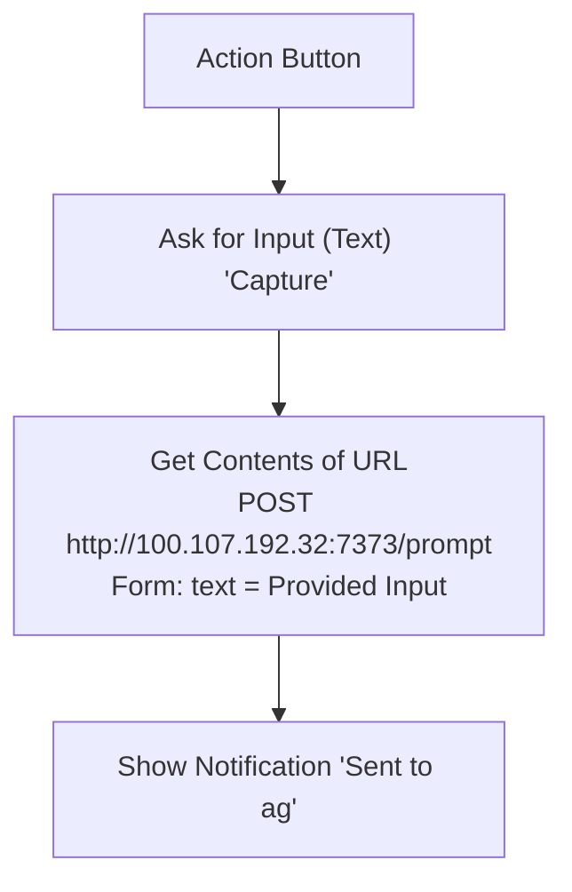

# iOS Shortcut: Capture to ag (Action Button)

Press the iPhone Action Button, type a prompt, and it lands in Herdr as a new pi
session, filed into the right workspace by `prompt-inbox` (port 7373, Tailscale only).
This is the GTD inbox capture point. The iPhone must be on the tailnet.

## Build steps

1. Shortcuts → new shortcut **Capture to ag**.
2. **Ask for Input**: Text, prompt "Capture".
3. **Get Contents of URL**: `http://100.107.192.32:7373/prompt`; Show More → Method **POST**,
   Request Body **Form**, field `text` (Text) = **Provided Input** (the magic
   variable from step 2, labeled **Ask for Input** on the verified iOS version).
4. **Show Notification**: "Sent to ag".
5. Save by tapping **Done** or returning to All Shortcuts (the verified iOS
   version saves on return). First run: allow connecting to `100.107.192.32` →
   **Always Allow**, or **Allow** if that is the only affirmative option.
6. Settings → **Action Button** → **Shortcut** → *Capture to ag*.

Test without the phone: `curl -X POST http://ag:7373/prompt -d 'hello'` → `202`.

## Verified on 2026-09-27

Codex (GPT-6), assisting Nathan:

Created the three actions above through iPhone Mirroring and verified their fields
on screen. Ran it once with `test capture from iPhone shortcut, please just reply
ok and do nothing else`; the server received the exact text and logged delivery
to the agent at 19:37:28 UTC (request `0c3aca72`). The Action Button settings
visibly showed **Shortcut → Capture to ag**. The temporary TextEdit document used
for clipboard entry was closed without saving.
