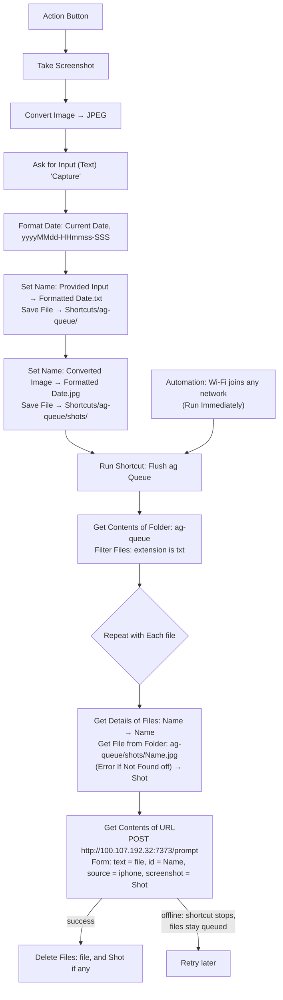

# iOS Shortcut: Capture to ag (Action Button, screenshot, offline queue)

Press the iPhone Action Button: it grabs a screenshot of whatever is on screen at that
moment, then asks for a prompt. Both land in Herdr's **Inbox** workspace as a new pi session
via the ag inbox (`ag-inbox`, port 7373, Tailscale only). This is the GTD inbox capture point.

The screenshot is only handed to the agent when it's needed: Jev judges from the prompt
whether it refers to what was on screen ("what song is this?" → attached; "remind me to call
mom Sunday" → not). The screenshot is always saved in `ag:~/inbox/capture/` either way.
Same gate as the Mac quick capture; see the README's "ag inbox" section.

Every capture is first saved to a queue folder on the phone (prompt as `<stamp>.txt`,
screenshot as `shots/<stamp>.jpg`), then the queue is flushed. If ag is unreachable (bad
signal, Tailscale down), the items stay queued and are sent on the next capture or when the
phone joins Wi-Fi. No success notification is shown. The server ignores a repeated `id`, so
resending an item whose response was lost is safe.

## Build steps

1. In Files, create the folders **iCloud Drive › Shortcuts › ag-queue** and **ag-queue › shots**.
2. Shortcut **Flush ag Queue**:
   1. **Get Contents of Folder**: ag-queue (Recursive off).
   2. **Filter Files**: Folder Contents where **File Extension** is `txt`.
   3. **Repeat with Each** item in Files:
      - **Get Details of Files**: **Name** of Repeat Item (variable *Name*).
      - **Get File from Folder**: Shortcuts folder, path `ag-queue/shots/[Name].jpg`,
        **Error If Not Found** off (variable *Shot*).
      - **Get Contents of URL**: `http://100.107.192.32:7373/prompt`; Method **POST**,
        Request Body **Form**; `text` (Text) = **Repeat Item**; `id` (Text) = *Name*;
        `source` (Text) = `iphone`; `screenshot` (File) = *Shot*.
      - **Delete Files**: Repeat Item; **Delete Immediately** off (files go to Recently Deleted;
        this iOS version shows no confirmation toggle).
      - **If** *Shot* has any value → **Delete Files**: *Shot* (Delete Immediately off). **End If**.
3. Shortcut **Capture to ag**:
   1. **Take Screenshot** (first, so it captures the screen before any prompt appears).
   2. **Convert Image**: Screenshot → JPEG (keeps the upload small on cellular).
   3. **Ask for Input**: Text, prompt "Capture".
   4. **Format Date**: Current Date, Custom `yyyyMMdd-HHmmss-SSS`.
   5. **Set Name**: Provided Input → `<Formatted Date>.txt`.
   6. **Save File**: Renamed Item → Shortcuts folder, subpath `ag-queue/`; Ask Where to Save off; Overwrite on.
   7. **Set Name**: Converted Image → `<Formatted Date>.jpg`.
   8. **Save File**: Renamed Item → Shortcuts folder, subpath `ag-queue/shots/`; Ask Where to Save off; Overwrite on.
   9. **Run Shortcut**: Flush ag Queue.
   No Show Notification action.
4. Automation → New → **Wi-Fi** → Any Network → **Is Joined** → **Run Immediately**
   → Run Shortcut **Flush ag Queue**.
5. First run: allow connecting to `100.107.192.32` → **Always Allow**; allow folder access and
   screenshots if asked.
6. Settings → **Action Button** → **Shortcut** → *Capture to ag*.

Offline, the flush step shows iOS's own "could not connect" error; the item is still
queued. Test without the phone:
`curl -X POST http://ag:7373/prompt --data-urlencode 'text=hello' -d id=test1` → redirect/`202`;
repeating it with the same `id` within 24 h logs `duplicate` and opens nothing.
Screenshot gate without opening anything:
`curl -F dry=1 -F 'text=what song is this' -F screenshot=@shot.png -F source=iphone http://ag:7373/prompt | jq -r .prompt`.

Note: before 2026-09-27's rebuild, the `id` field used Repeat Item › Name and arrived as the
capture text rather than the file name, so the server's dedup window is 24 hours, not permanent.

## Verified on 2026-09-27

Claude (anthropic-primary/claude-opus-5-5), assisting Nathan:

Built with computer use (Mac Shortcuts app, synced via iCloud; automation and test via
iPhone Mirroring). Ran **Capture to ag** on the phone: the server received the text
(request `5e879379`), it opened in the Inbox workspace, and ag-queue was empty afterwards.

