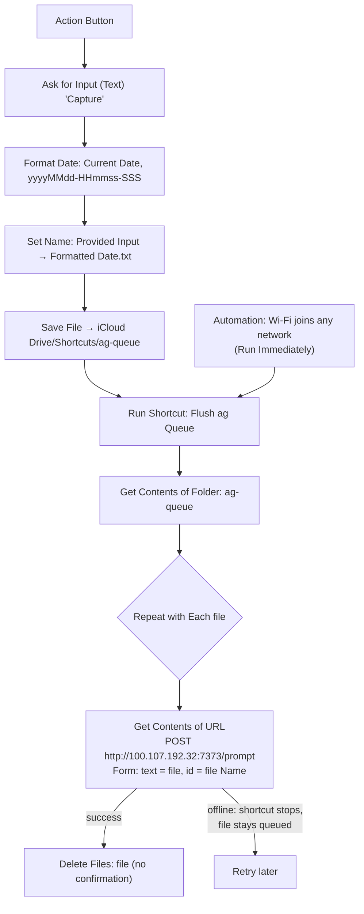

# iOS Shortcut: Capture to ag (Action Button, offline queue)

Press the iPhone Action Button, type a prompt, and it lands in Herdr's **Inbox**
workspace as a new pi session via `prompt-inbox` (port 7373, Tailscale only). This is
the GTD inbox capture point.

Every capture is first saved to a queue folder on the phone, then the queue is flushed.
If ag is unreachable (bad signal, Tailscale down), the item stays queued and is sent on
the next capture or when the phone joins Wi-Fi. No success notification is shown.
The server ignores a repeated `id`, so resending an item whose response was lost is safe.

## Build steps

1. In Files, create the folder **iCloud Drive › Shortcuts › ag-queue**.
2. New shortcut **Flush ag Queue**:
   1. **Get Contents of Folder**: ag-queue.
   2. **Repeat with Each** item in Contents of Folder:
      - **Get Contents of URL**: `http://100.107.192.32:7373/prompt`; Method **POST**,
        Request Body **Form**; `text` (Text) = **Repeat Item**; `id` (Text) = **Repeat Item › Name**.
      - **Delete Files**: Repeat Item; **Confirm Before Deleting** off.
3. Shortcut **Capture to ag**:
   1. **Ask for Input**: Text, prompt "Capture".
   2. **Format Date**: Current Date, Custom `yyyyMMdd-HHmmss-SSS`.
   3. **Set Name**: Provided Input → `<Formatted Date>.txt`.
   4. **Save File**: Renamed Item → ag-queue; Ask Where to Save off; Overwrite on.
   5. **Run Shortcut**: Flush ag Queue.
   No Show Notification action.
4. Automation → New → **Wi-Fi** → Any Network → **Run Immediately** (Notify When Run off)
   → Run Shortcut **Flush ag Queue**.
5. First run: allow connecting to `100.107.192.32` → **Always Allow**; allow folder access.
6. Settings → **Action Button** → **Shortcut** → *Capture to ag*.

Offline, the flush step shows iOS's own "could not connect" error; the item is still
queued. Test without the phone:
`curl -X POST http://ag:7373/prompt --data-urlencode 'text=hello' -d id=test1` → redirect/`202`;
repeating it with the same `id` logs `duplicate` and opens nothing.
