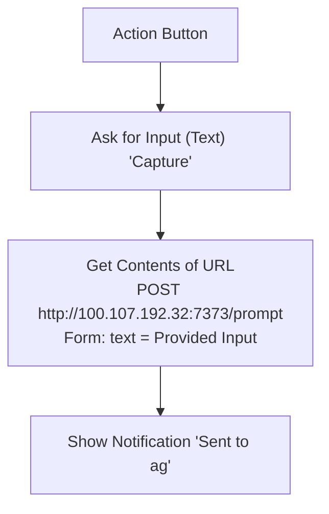

# iOS Shortcut: Capture to ag (Action Button)

Press the iPhone Action Button, type a prompt, and it lands in Herdr as a new pi
session, filed into the right workspace by `prompt-inbox` (port 7373, Tailscale only).
This is the GTD inbox capture point. The iPhone must be on the tailnet.

## Build steps

1. Shortcuts → new shortcut **Capture to ag**.
2. **Ask for Input**: Text, prompt "Capture".
3. **Get Contents of URL**: `http://100.107.192.32:7373/prompt`; Show More → Method **POST**,
   Request Body **Form**, field `text` (Text) = **Provided Input**.
4. **Show Notification**: "Sent to ag".
5. First run: allow connecting to `100.107.192.32` → **Always Allow**.
6. Settings → **Action Button** → **Shortcut** → *Capture to ag*.

Test without the phone: `curl -X POST http://ag:7373/prompt -d 'hello'` → `202`.
