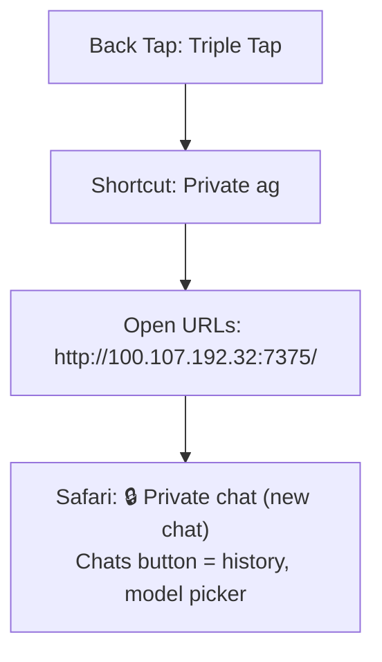

# iOS Shortcut: Private ag (Back Tap, triple tap)

A **triple tap on the back of the iPhone** opens a private chat page on ag
(`ag-private`, `http://100.107.192.32:7375/`, Tailscale only). Its inference goes straight to
**OpenRouter** on Nathan's personal account, never through TrueFoundry, Jev, or the ag inbox, so
personal questions stay off the work stack. Chats are saved only on ag (`~/private-chat`, mode 700).

## Build steps

1. Shortcut **Private ag** (can be built in the Shortcuts app on ag or any Mac; it syncs to the
   phone through iCloud): one action, **Open URLs** `http://100.107.192.32:7375/`.
2. On the iPhone (Back Tap is a per-device setting and does not sync): **Settings › Accessibility ›
   Touch › Back Tap › Triple Tap › Private ag**.
3. Optional: in Safari, Share › **Add to Home Screen** for a full-screen "Private" app icon.

Voice: use the keyboard's dictation mic in the text box. Keep **Settings › General › Keyboard ›
Dictation** on-device where the phone offers it, so speech isn't sent anywhere either.
