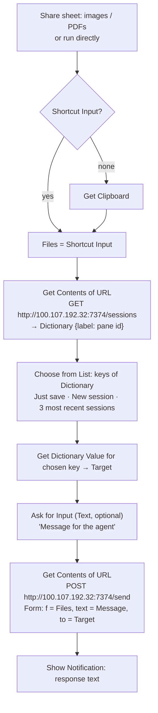

# iOS Shortcut: Send to ag

Share a screenshot or photo from the iPhone, optionally add a message, and either
save it on ag or hand it to a pi session. Talks to `file-inbox` on ag
(`bin/dot-local/bin/file-inbox`, port 7374, Tailscale only). The iPhone must be on
the tailnet (Tailscale app connected).

## Flow



Server behaviour for `POST /send`:
- `to` empty ("Just save"): files saved to `ag:~/inbox/phone/`.
- `to=new`: forwarded to prompt-inbox, which opens a new Herdr tab running pi.
- `to=<pane id>`: `herdr agent prompt <pane> "<text> + file paths"`; pi reads the image paths.

## Build steps (Shortcuts app)

1. New shortcut **Send to ag**. Details: **Show in Share Sheet** on; types Images,
   Media, PDFs, Files. "If there's no input": **Get Clipboard**.
2. **Get Contents of URL** — `http://100.107.192.32:7374/sessions`, Method GET.
3. **Get Dictionary from Input** (input: Contents of URL).
4. **Get Dictionary Value** — Get **All Keys** in Dictionary.
5. **Choose from List** (input: Keys), prompt "Send to".
6. **Get Dictionary Value** — Get **Value** for **Chosen Item** in Dictionary. Rename variable: *Target*.
7. **Ask for Input** — Text, prompt "Message (optional)". Allow empty. Variable: *Message*.
8. **Get Contents of URL** — `http://100.107.192.32:7374/send`, Method POST,
   Request Body **Form**:
   - `f` → File → **Shortcut Input**
   - `text` → Text → *Message*
   - `to` → Text → *Target*
9. **Show Notification** — Contents of URL.

First run: allow the shortcut to connect to `100.107.192.32` ("Always Allow").

## Test without the phone

```sh
curl http://ag:7374/sessions
curl -F f=@shot.png -F "text=what's wrong here?" -F to= http://ag:7374/send
```

Browser fallback (same form, any device on the tailnet): http://100.107.192.32:7374/
