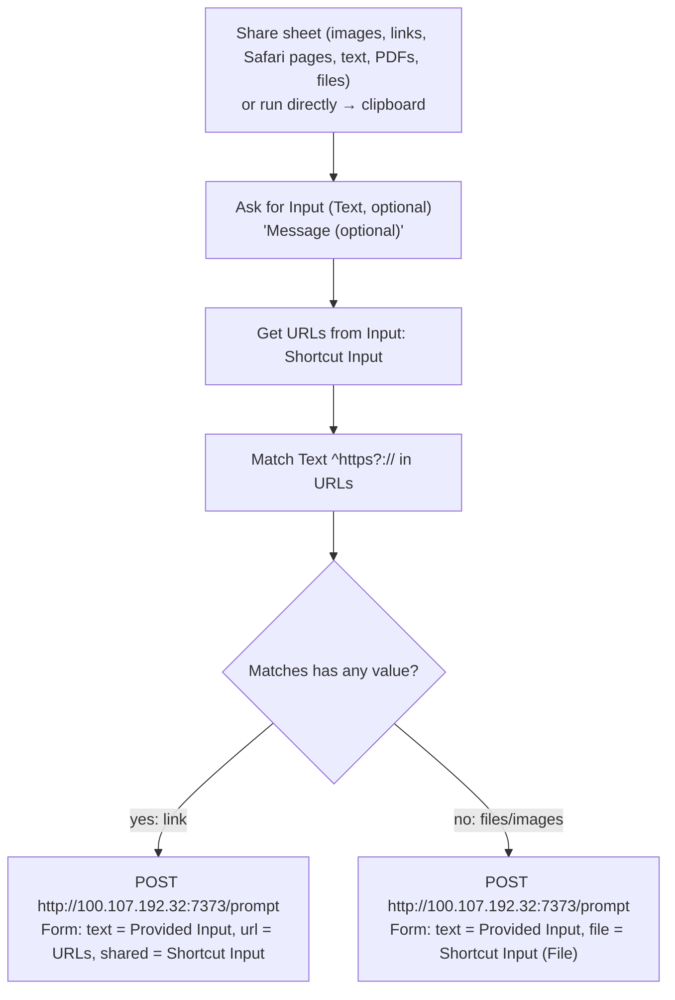

# iOS Shortcut: Share to ag (share sheet)

The fastest way to hand ag anything from the iPhone: in any share sheet (a screenshot's
thumbnail, Photos, Safari, a link, text, a PDF) tap **Share to ag**, optionally type a
message, and it opens a new pi session in Herdr's **Inbox** workspace. No session picker,
no confirmation. For choosing an existing session instead, use **Send to ag**
(`send-to-ag.md`). The phone must be on the tailnet (Tailscale connected).

Fastest screenshot path: take a screenshot → tap the thumbnail → Share → **Share to ag**.
To grab the screen and type a prompt in one press, use the Action Button
(`capture-to-ag.md`), which now attaches a screenshot too.

It posts to the ag inbox (`bin/dot-local/bin/ag-inbox`, port 7373):
- `file` (repeatable): images/files. Saved to `ag:~/inbox/share/`, always attached. HEIC
  photos are converted to JPEG so pi can read them.
- `url` + `shared`: a shared link and the shared text.
- `text`: the optional message. With no message, the agent works out what you most likely want.

The inbox then routes the capture: a cheap multimodal model (it sees the shared images)
names the tab and picks a **playbook** when one fits (e.g. a contact card or a name +
phone number → the `contact` playbook). See the README's "ag inbox" section.



## Build steps (Shortcuts app; built on the Mac, syncs to the phone via iCloud)

1. New shortcut **Share to ag**. Details: **Show in Share Sheet** on; receives Images,
   URLs, Safari web pages, Text, Rich Text, PDFs, Files, Media. "If there's no input":
   **Get Clipboard**.
2. **Ask for Input**: Text, prompt `Message (optional)`, Allow Multiple Lines on, no default.
3. **Get URLs from Input**: Shortcut Input.
4. **Match Text**: `^https?://` in *URLs*.
5. **If** *Matches* **has any value**:
   - **Get Contents of URL**: `http://100.107.192.32:7373/prompt`, Method POST, Request Body
     Form: `text` (Text) = *Provided Input*; `url` (Text) = *URLs*; `shared` (Text) = *Shortcut Input*.
6. **Otherwise**:
   - **Get Contents of URL**: same URL, POST, Form: `text` (Text) = *Provided Input*;
     `file` (File) = *Shortcut Input*.
7. **End If**. No notification: the share sheet shows its own checkmark.

First run on the phone: allow connecting to `100.107.192.32` → **Always Allow**.

## Test without the phone

```sh
H=http://100.107.192.32:7373/prompt
curl -F dry=1 -F file=@card.heic "$H" | jq '{label,playbook}'     # routes, opens nothing
curl -F dry=1 -F url=https://example.com -F shared=https://example.com "$H" | jq .prompt
curl -F file=@shot.png -F "text=what is this?" "$H"                # real: opens an Inbox tab
```
